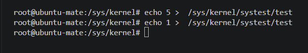

# kbleds — мигание светодиодами клавиатуры

## Сборка:
make
## Установка модуля:
sudo insmod kbleds.ko

## Изменяем значение в sysfs:

echo 1 >  /sys/kernel/systest/test
## Выгрузка:
sudo rmmod kbleds.ko