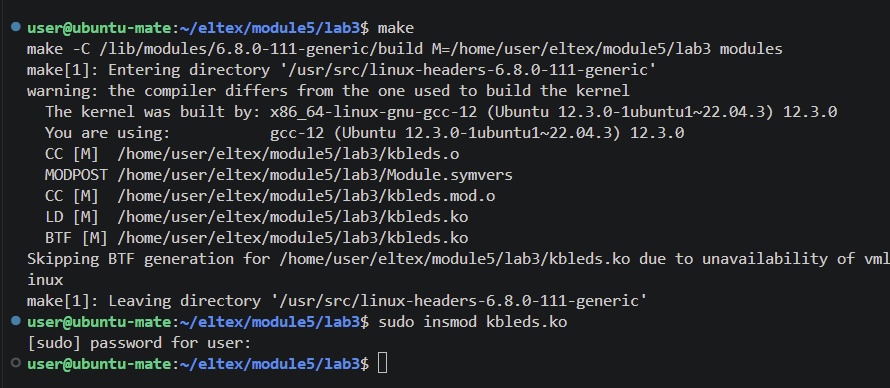

# kbleds — мигание светодиодами клавиатуры

## Сборка:
make
## Установка модуля:
sudo insmod kbleds.ko

## Изменяем значение в sysfs:
echo 1 >  /sys/kernel/systest/test

## Выгрузка:
sudo rmmod kbleds.ko