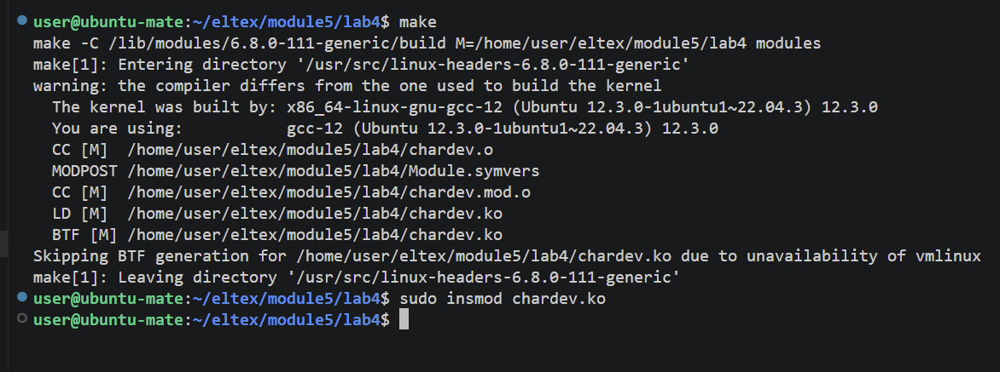
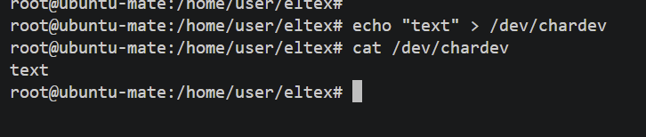

# Обмен информацией с userspace через chardev   

## Сборка:  
make    
## Установка модуля:    
sudo insmod chardev.ko  
 

## Ввод вывод в chardev(под root):  
echo "text" > /dev/chardev  
cat /dev/chardev    
 

## Выгрузка:
sudo rmmod chardev.ko