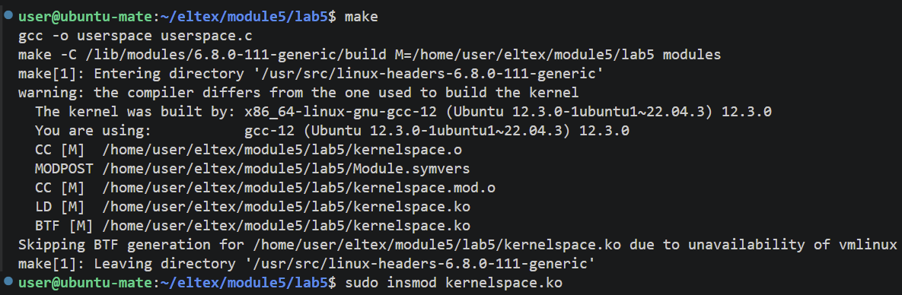
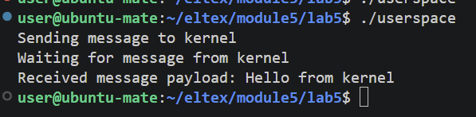

# Обмен информацией с userspace через chardev   

## Сборка:  
make    
## Установка модуля:    
sudo insmod kernelspace.ko 
 

## Запуск userspace:  
./userspace  

 

## Выгрузка:
sudo rmmod kernelspace.ko 

## Очистка  
make clean